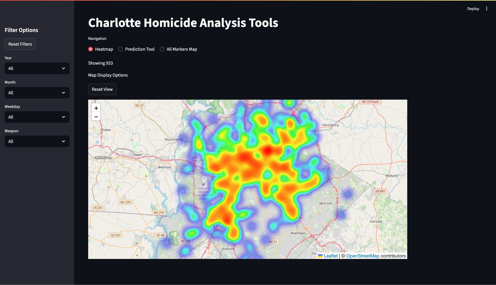
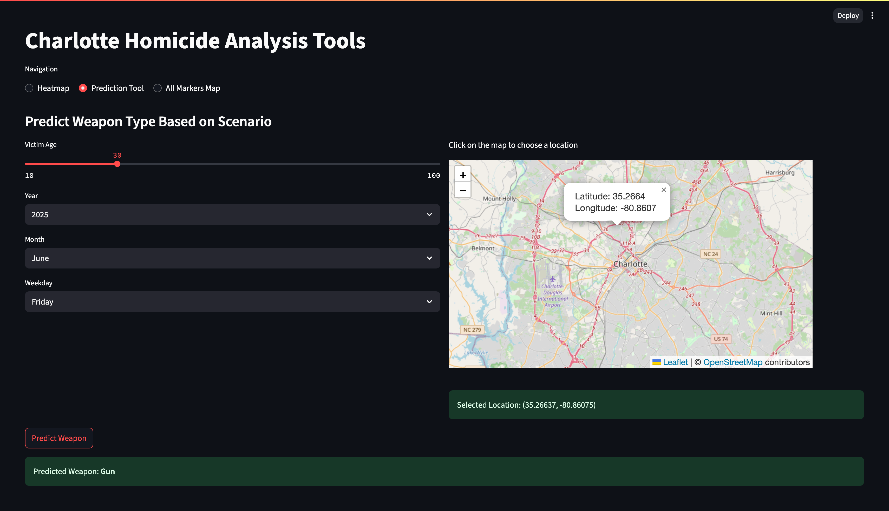
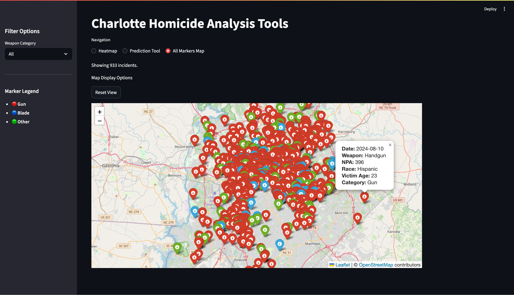

# Charlotte Homicide Analysis Tools

This project provides interactive tools for exploring and analyzing homicide data in Charlotte, NC. It includes a Streamlit app with:

- A heatmap tab to visualize spatial patterns
- A prediction tool to estimate likely weapon type based on incident data
- A marker-based map for viewing individual case details

The data is sourced from the Charlotte Open Data API and includes fallback mechanisms to ensure offline availability.

## Preview

Below are example screenshots from the Charlotte Homicide Analysis Tools web app:

### Heatmap Tab


### Prediction Tool


### Marker Map


## Features

- Interactive filtering by year, month, weekday, and weapon type
- Machine learning prediction model for weapon classification
- Dynamic heatmaps and popup-rich marker maps
- API integration with automatic fallback to local data
- Modular code structure with unit tests

## Tech Stack

- Python
- Streamlit
- Pandas
- Folium
- Scikit-learn (for ML model)
- Jupyter Notebooks (for development)
- Charlotte Open Data API (JSON)
- Requests
- Numpy
- Matplotlib
- Joblib

## Installation

1. Clone the repository:

   ```bash
   git clone https://github.com/calteeling/charlotte-homicide-analysis.git
   cd charlotte-homicide-analysis
   ```

2. Create and activate a virtual environment:

   ```bash
   python -m venv myenv
   source myenv/bin/activate   # Windows: myenv\Scripts\activate
   ```

3. Install the dependencies:

   ```bash
   pip install -r requirements.txt
   ```

## Running the App

To launch the app in your browser:

```bash
streamlit run app.py
```
If the Charlotte crime API is unavailable, the app will automatically fall back to using local JSON or CSV files in the `data/` directory.

## Testing

To run all unit tests:

```bash
python -m unittest discover -s tests
```
This will verify the utility functions used for data filtering, prediction, and formatting.

## Data Source

The data used in this project comes from the [Charlotte Open Data Portal](https://data.charlottenc.gov/)(specifically the https://data.charlottenc.gov/datasets/charlotte::cmpd-homicide/) which provides crime incident information through a public API. To ensure reliability, a backup dataset is included in the project.

Please use this data responsibly and respectfully—this project is for analytical and educational purposes only.

## Insights
Overall, I'm really happy with how this project turned out. I set out to build a comprehensive data analysis tool, and I believe it's quite functional. It’s worth noting that the machine learning component is fairly basic. This is mainly due to the dataset being heavily weighted toward 'gun'-related incidents. As a result, the prediction tool often defaults to predicting 'gun' and rarely outputs 'blade' or 'other'.

If I were to do this project over again, I would likely take more time to separate weapon classes—such as distinguishing between handguns and rifles. However, I decided against this to avoid cluttering the app with too many options.

I'm also really pleased with the way the data integration works. From the beginning, it was important to me that the app could access up-to-date data from the API. In case something goes wrong with the API, the app includes two fallback options: one using the most recent saved JSON file, and another using an archived version of the dataset.

Finally, it's important to acknowledge that this data is derived from tragic real-world events that occurred throughout Charlotte, NC. Crime is a complex and sensitive subject, and I want to emphasize that I worked with this data with the utmost respect for the victims and their families. The prediction tool is intentionally simple and should be taken with a grain of salt. My goal with this project was to strengthen my data analysis skills and better understand urban crime patterns.

When building predictive models, there's always a risk of reinforcing stereotypes or making unfair generalizations—especially when it comes to neighborhoods or race. That’s why I chose not to include NPA (Neighborhood Planning Area) in the prediction tool. If you plan to work with this data or build upon this project, I encourage you to be mindful of these considerations.

## License

This project is licensed under the MIT License.

## Author

Developed by Cal Teeling as part of a data science portfolio project.
